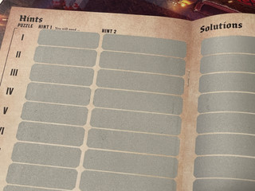
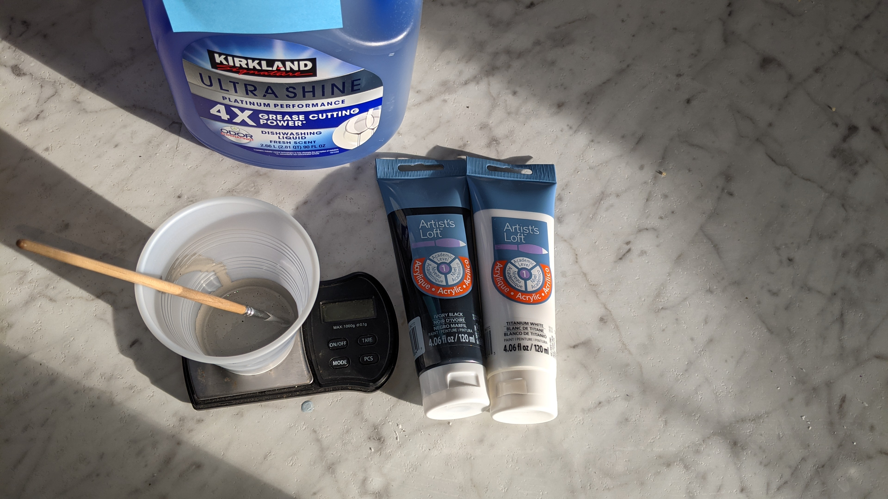
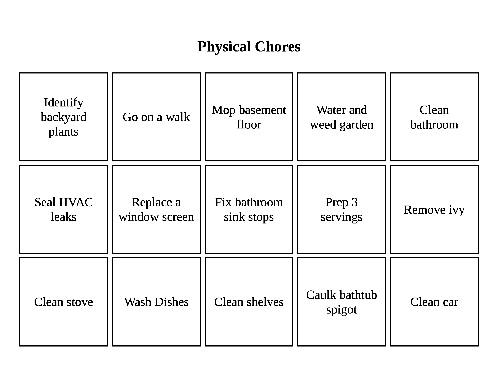
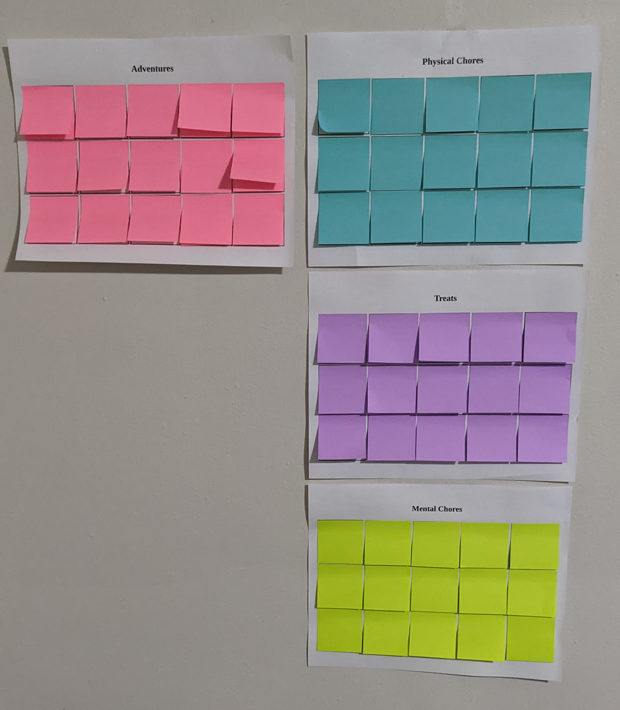
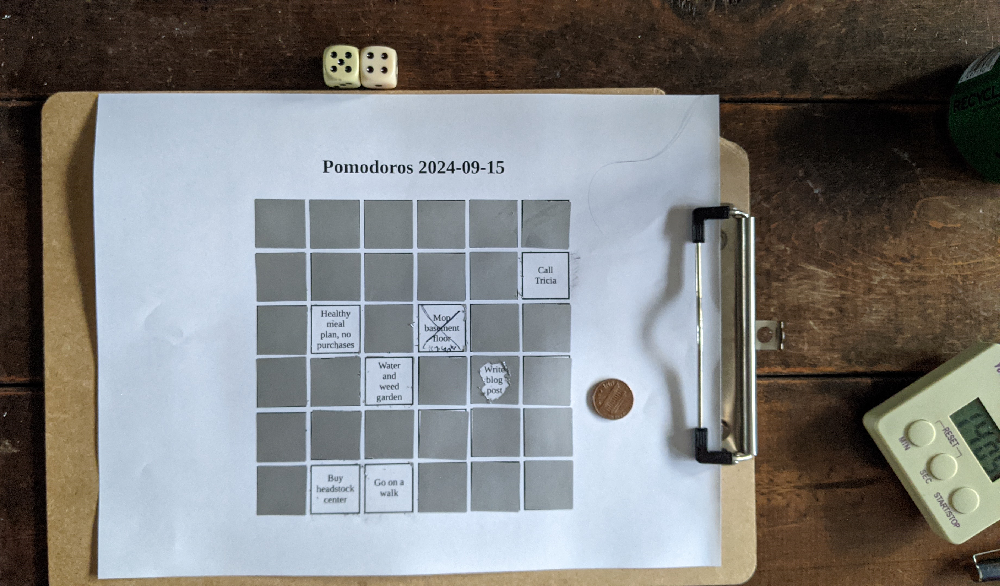
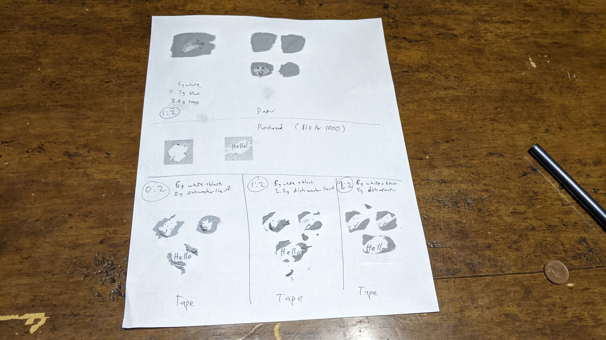

My family and I have been playing [Curse of the Dark](https://www.amazon.com/Curse-Dark-Escape-Room-Game/dp/B09ZCCCZQQ), an "escape-room" style board game. We recently reached the halfway point, where they recommend taking a break--it's supposed to be two 90-minute play sessions (spoiler: we are on month 6).

Included with the box is an answer sheet, which include scratch-off hints. (You might also be familiar with them from lottery tickets.) You scratch off the grey stuff with a penny, and underneath is the hint. I idly wondered if you could do that yourself.

I found several people online repeating this recipe: 

- 2 parts silver acrylic paint (I used 5 parts white, 1 part black)
- 1 part dish soap

They recommended 2-4 layers to make it opaque. I gave it a try.

So visually it looked pretty good. But scratchable, not so much. It was hard to get off, and the paper tore when I scratched harder. 

[Randomona](https://www.instructables.com/member/Randomona/instructables/) did [some experimentation](https://www.instructables.com/Scratch-Off-Cards-From-Scratch/), and had better luck with all types of paint. Turns out it works way better if you add a layer of plastic, such as tape, rather than applying to paint directly to paper or cardstock. This makes sense since the stickers are basically a thin layer of something on tape. And sure enough, when I looked at the 2-3 other tutorials I read, they all said to **apply tape first**. Whoops!

I would discover this only later, pictures are later in the post

---

I decided to give "the reveal" a try with small [square post-it notes](https://www.amazon.com/Sticky-Sticking-Collection-Sheets-622-8SSMIA/dp/B01D8F5AWG) (50x50 mm, about 2x2 inch).

These were okay. But

- not many fit on a page
- post-its aren't very fun to take off
- sometimes I had to use two notes, or you could see through
- my local store doesn't sell the full-sticky post-its, so you can peek if you really wanted. (I'm not sure if they still make full-sticky, and I don't think they ever did in mini size)

By the way, you can print your own using [my bad generator](https://za3k.com/archive/postits). If you want less than 15, just leave some boxes blank and don't cover them with a post-it.

Next up, I bought some! They sell premade scratch-off stickers. They are available in [50x50 mm](https://www.amazon.com/Scratch-Off-Stickers-Self-Adhesive-Fundraisers-Promotions/dp/B07CKL9GPM), but I went half that size--I'd rather have more on a page.

Mine came in a roll of 1000 stickers for $10 (that's 1 cent per sticker). You can get [circles](https://www.amazon.com/Scratch-Stickers-Adhesive-Lottery-Creating/dp/B0BN8762KW) or [squares](https://www.amazon.com/Mr-Label-Pcs-0-87-Stickers-Programs/dp/B0CQQSXBCP)--I picked squares.

Here you can see my scratch-off chores card. It was a lot more fun. I wrote [a better second generator](https://za3k.com/archive/scratchoffs) you can use to print your own. Up to 88 can fit on a page, and it will shrink the grid if you have less.

---

Finally, I tried the homemade acrylic paint method a try, with tape this time.

I'd say the stickers scratch off best, followed by the recipe mentioned on tape. I tried more dish soap and no dish soap, and they were both worse. I suspect less dish soap would work better.

You can write on the stickers fine, or the acrylic, but the dish soap recipes scratch off if you try to use a pen on top.
